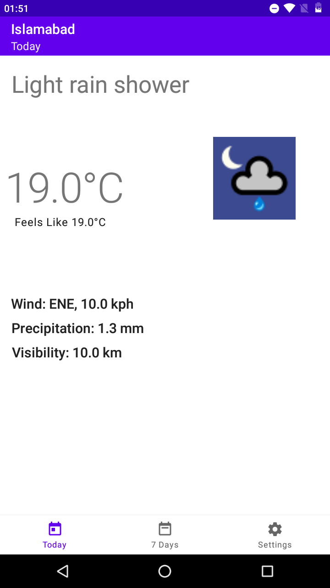
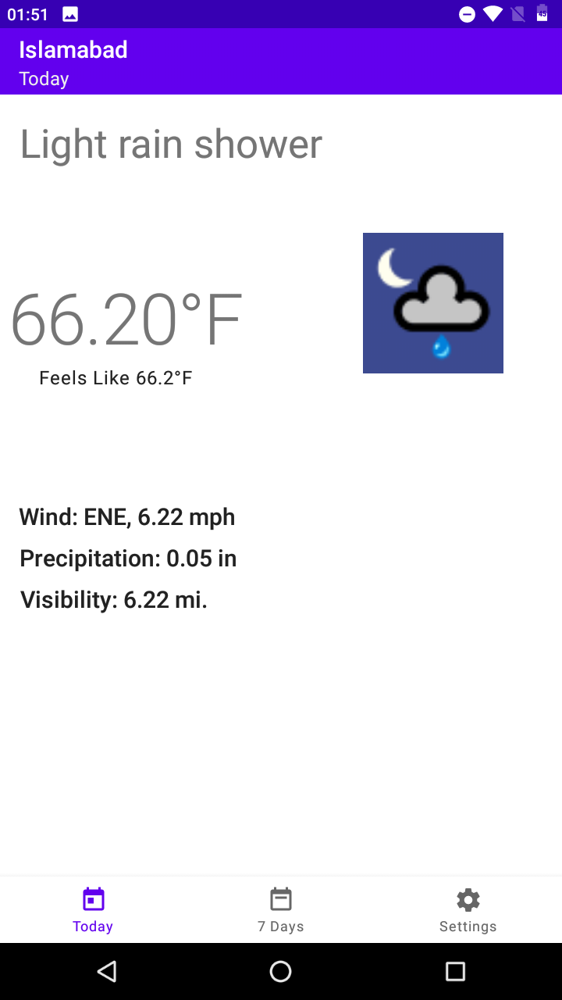
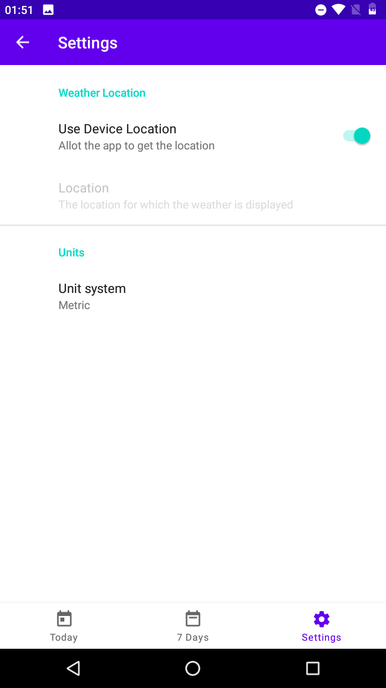

# Forecast
Forecast Android Application using WeatherStack API. Built using MVVM and Android Architecture Components in Kotlin

Following ResoCoder's Playlist about Apixu Weather Api I've developed the application using current weatherstack.
In this application users can 
  - See the current weather
  - Use device location or type custom location
  - Change between metric or imperial units

I have completed 10 of 14 parts of the playlist because getting 7 days forecast in not free anymore. So that is an empty screen. :(

I haven't deleted my ACCESS_KEY from the application but you should use your own ACCESS_KEY from https://weatherstack.com
 
 Signup and get your own access key.

Libraries:
  - Navigation
  - ROOM
  - Gson
  - Kotlin Android Coroutines
  - Retrofit
  - lifecycle ViewModel
  - Kodein
  - threetenabp
  - Glide
  - Groupie
  - Preference
  - WeatherLocation
  - Material Design
  
  
  1.   Screenshot of Weather Screen in Metric Units
  
  
  
  2.   Screenshot of Weather Screen in Imperial Units
  
  
  
  3.   Screenshot of Settings Screen
  
  
